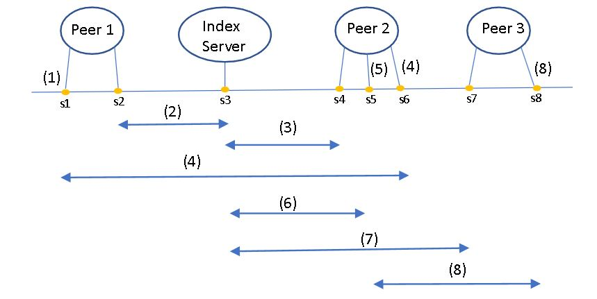
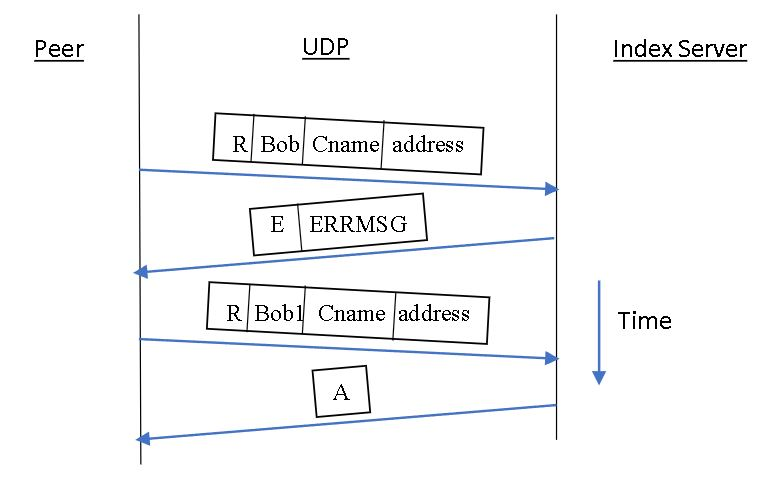
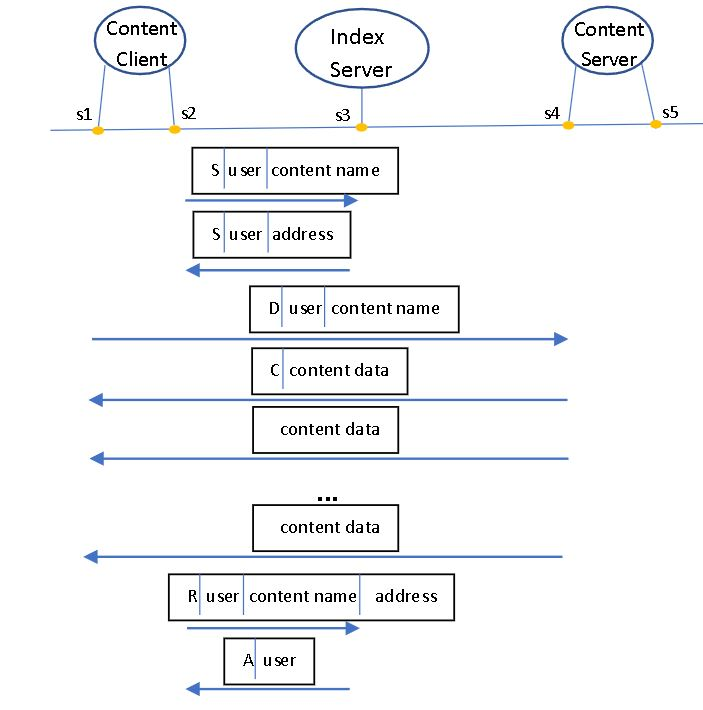

# P2P Application Project

## Table of Contents
- [Overview](#overview)
- [Features](#features)
- [Project Plan](#project-workflow)
- [Code Highlights](#Code_Highlights)

## Overview
This project implements a Peer-to-Peer (P2P) application, consisting of an index server and multiple peers. The system allows peers to exchange content through the index server, enabling content registration, search, download, and deregistration functionalities. The communication utilizes **UDP** for interaction with the index server and **TCP** for content transfer.

## Features
- **Content Registration**: A peer registers its content with the index server, providing the IP address and port for access.
- **Content Search**: A peer queries the index server for the location of specific content.
- **Content Download**: A peer downloads content directly from another peer using TCP.
- **Content Deregistration**: A peer deregisters its content when it's no longer available or before exiting.
- **Content Listing**: Peers can retrieve a list of all registered content from the index server.
- **Load Balancing**: The index server evenly distributes download requests among multiple peers hosting the same content.

## Project Workflow
The following diagrams outline the P2P application workflow:

### Peer and Index Server Interaction

### PDU Transactions for Content Search and Download

### Content Registration, Search, and Download

## Code Highlights
### Protocol Data Units (PDUs)
The P2P application uses eight types of PDUs for communication:
- **R**: Content Registration
- **S**: Search for content
- **D**: Download request
- **C**: Content data transfer
- **T**: Content Deregistration
- **A**: Acknowledgment
- **E**: Error message
- **O**: List of registered content

### Key Functionalities
- **Index Server**:
  - Manages content registration, search, and deregistration.
  - Responds to peers with content locations or error messages.
- **Peers**:
  - Register and search for content using UDP.
  - Serve content to other peers and download content via TCP.
